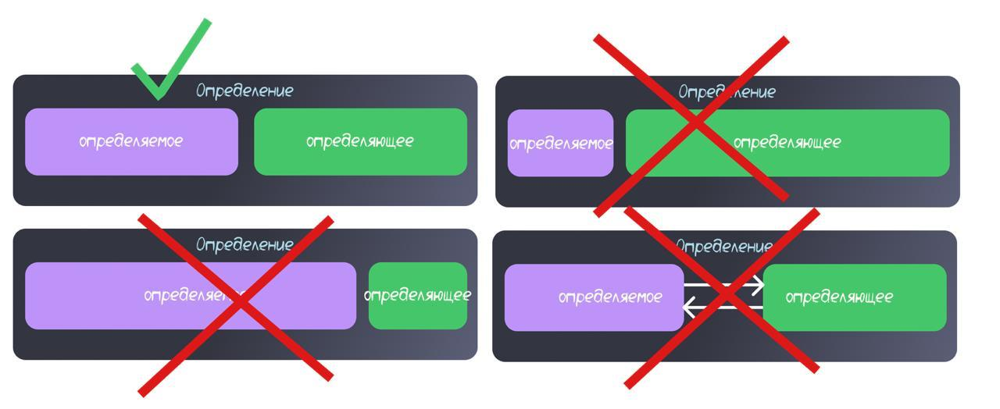

На майских в поездке слушал аудиокнигу ["Анатомия заблуждений"](https://books.yandex.ru/books/t5e1WXOs?ysclid=mkhx844zhg528501219). Меня там зацепили подходы к составлению определений - думаю, они довольно универсальны и типичны для логики, но в этой книге они были хорошо поданы, потому на неё и ссылаюсь.

Я попробовал адаптировать эти подходы для глоссариев ИТ-проектов - чтобы сделать термины более понятными и строгими.

Вообще, я считаю, что о терминах всегда важно договариваться. По тегу #glossary в канале можно найти и смешные цитаты, и вполне реальные истории, когда разночтение терминов приводило к фейлам на проектах.

Итак:



Определение всегда имеет две части: определяемое и определяющее.



1. Определяемое должно строго соответствовать определяющему. Определение не должно быть ни слишком широким, ни слишком узким.

Рассмотрим примеры в табличке.

#|
||
Слишком широкое определение
|



Пользователь - это человек.



Пояснение: Каждый пользователь - человек, но не каждый человек - пользователь системы.
||
||
Слишком узкое определение
|


Роль - это набор разрешений, назначаемых пользователю сайта для просмотра информации в личном кабинете.



Пояснение: Роль может назначаться не только на сайте, и используется не только для просмотра информации, но и для совершения операций.
||
||
Одновременно узкое и широкое определение
|



Событие - это изменение состояния пользователя в приложении.



Пояснение: Не все события связаны именно с пользователями. И не каждое изменение состояния пользователя фиксируется системой - например, если пользователь перешёл в состояние алкогольного опьянения, система этого не узнает.
||
|#

2. Не используйте голые перечисления

Плохо:



Ресурс - это виртуальная машина, база данных, сеть, ...



Пояснение: Перечисления допустимы только как примеры, а не как основа определения.

3. Избегайте зацикленности



Имперсонация - выполнение имперсонации





Контейнеризация - метод упаковки кода в контейнеры

Контейнеры - сущности для обеспечения контейнеризации





Конфикс - это циркумфикс



Если приходится это делать, убедитесь, что оба определения раскрыты в глоссарии.

4. Без оценок и эмоций



Системный аналитик - специалист, который вечно душнит не по делу, задаёт очевидные и ненужные вопросы



Формулируйте нейтрально и по сути.

5. Начинайте определение с родо-видового признака

То есть, сначала отнесите термин к более широкой категории (**роду**), а затем уточните специфические признаки, которые его отличают среди других объектов этого класса.

6. Не используйте конструкцию "это когда"



Снапшот - это когда сохраняется конфигурация



7. Не начинайте определение с отрицания



Refresh-токен - это не access-токен



Лучше раскрывайте, что представляет собой refresh-токен.

8. Раскрывайте аббревиатуры

Это допустимо и полезно, чтобы избежать недопонимания.

9. Синонимы группируйте и определяйте только один вариант

Указывайте основной термин, остальные ссылайте на него.

10. Для омонимов давайте отдельные определения для разных значений

Если термин многозначный, выберите определение для каждого значения, либо введите новые уникальные термины.

---

[Запись в ТГ-канале](https://t.me/highuncertainty/160)
